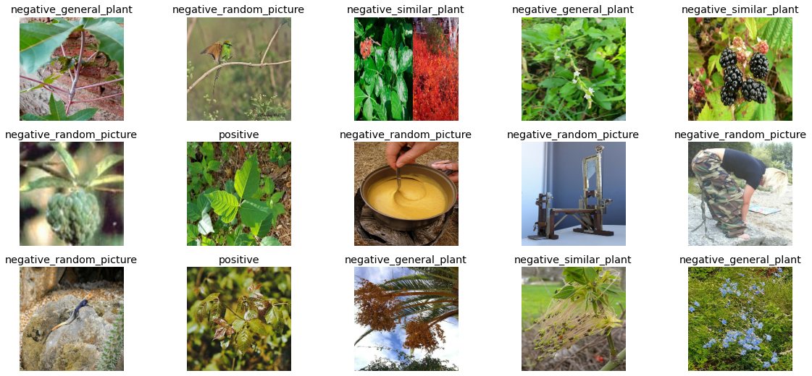
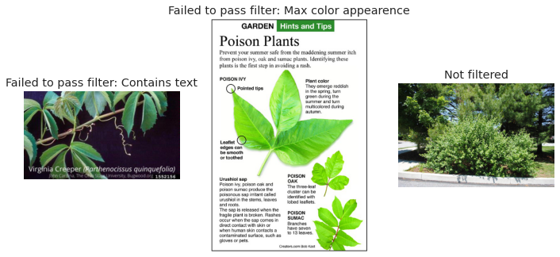
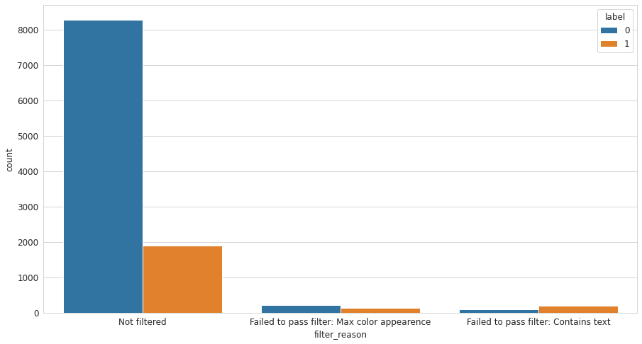
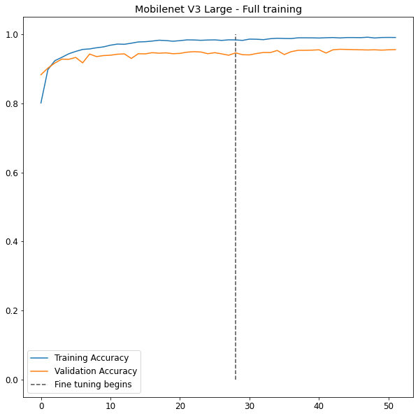
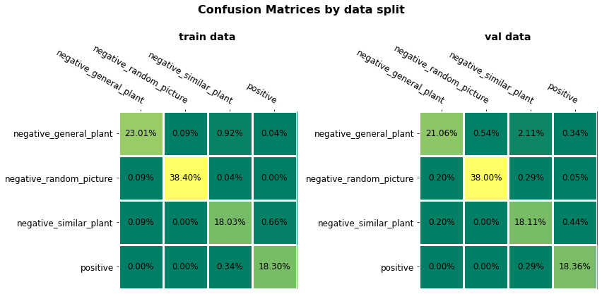
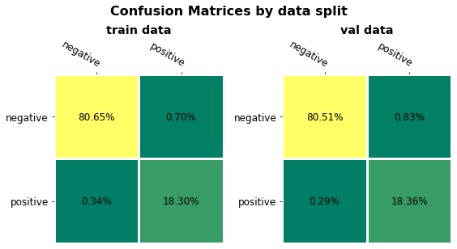
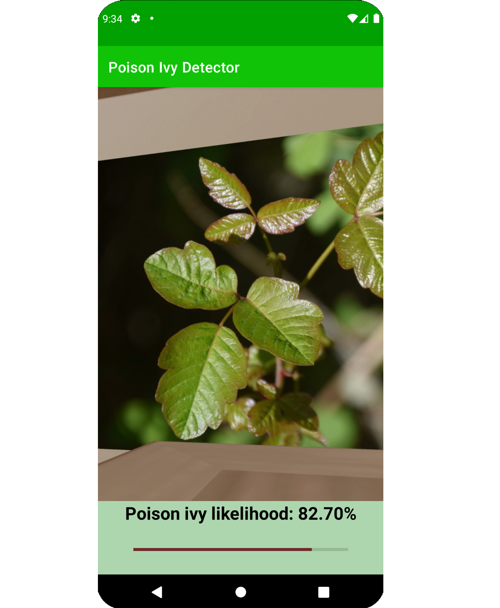

# Poison Ivy Detector - Overview

• Assembled dataset of around 10,000 images via web-scraping & API calls with metadata managed in Postgres database across steps

• Filtered out bad images by devising and applying custom filter functions that capture undesired traits

• Tuned a MobileNetV3 model to classify images using transfer learning & fine-tuning in Tensorflow

• Exported model with TF Lite and adapted into a simple Android app to detect poison ivy in camera feed.

---

# Implementation Details

The end goal for this project is an app that can distinguish whether or not the camera feed contains poison ivy. This project is built for educational purposes to explore and demonstrate modern data science techniques.

To view similar projects, [check out my Data Science portfolio page](https://kenwronka.github.io/data_science_portfolio/).

As this is for educational purposes, I am keeping old and "pilot" versions of the code; [the most recent version of the model steps code can be found here](./code/model_pipeline_v1).

## Creating the development environment

For reproducability, a Docker-Compose development environment is used containing two images:
 - A custom image (see Dockerfile) containing Python + Tensorflow with GPU integration and a series of data-science utility packages
 - A standard Postgres image

The development environment uses the Postgres container for dataset-metadata storage.

## Assembling the dataset

For classification, we need a mix of images that do/don't contain poison ivy.

To get positive images for poison ivy, I chose to scrape Google Images searching for "poison ivy plant."

Negative images are a bit more complicated; initially I set out to create a pilot model using difficult examples by scraping for images of plants that the [Poison Ivy Wikipedia article](https://en.wikipedia.org/wiki/Toxicodendron_radicans) claims look similar to poison ivy. While this helped the model with difficult cases, it also meant that the model would be very uncertain on random images that looked nothing like poison ivy or similar plants.

I therefore set out to create negative examples ranging from these difficult cases to cases that should be very obvious, ultimately breaking the negative cases into three classes:

1. Negative Similar Plant -- Images of plants that look like Poison Ivy, scraped from Google Images (hard examples)
2. Negative General Plant -- A general dataset of all plants in the PlantNet dataset gathered via public API, whether or not they look similar to poison ivy (medium examples)
3. Negative Random Picture -- A random assortment of pictures downloaded from the ImageNet dataset that in most cases aren't of plants at all (easy examples)

With this spectrum of negative cases, we can still have the model distinguish difficult cases you'd want it to answer correctly, while not giving non-sensical answers if you supply a non-plant image.

Examples:

To manage this and the future processing steps, I created a Postgres database to manage the image file locations and other metadata.

## Filtering the images

Many images in the raw dataset would not work for my desired dataset, especially those from Google Images. For exmaple, an image may show a diagram of a poison ivy leaf and some text rather than just being an image of the plant as would show up in your phone camera.

I manually inspected and labelled some "bad" images and lumped together traits that I could target to try to remove undesired images from the dataset.

After some experimentation, I ultimately landed on 3 filters:

1. Images which could not be read (due to not downloading properly, etc.) --> discard images upon read error
2. Images which contain text: likely to be a diagram or some other undesired image --> use pytesseract Optical Character Recognition to record image text and filter out all images which contain characters other than white space
3. Images with too much of a single color: likely to have some artificially solid color background and thus not be a natural image --> Calculate the % of pixels of the most common color and filter at a threshold

Here are examples of the filters in action based on images which were flagged:

Here are data on how many images ultimately were filtered out:

## Splitting the dataset

I wanted flexibility in experimenting with different splits so I created a pipeline for labelling data by class and train/test/validation split; a full set of images labelled this way is added to the database as a dataset which contains the parameters used to assemble it and pointers to all the images that need to be read for that dataset.

I ultimately used just a train/validation split of 80/20.

I also wanted to experiment with the negative labels; I was not sure whether it would be best to create one negative class that encompasses all 3 data sources, or give each source it's own negative subclass. I created datasets for each case.

## Fitting the model

After smoe experimentation, I landed on utilizing a MobileNetV3 - Large model and fine-tuning for my case. The main thought processes were:
 - Taking advantage of transfer learning
 - Using an architecture intended for usage on mobile CPU's

This model was implemented in Tensorflow using the built in MobileNet model from Keras, just removing the classification head training on ImageNet.

I had limited computational resources to do extensive tuning of the model, but did some experimentation with:
 - Learning rates (base & fine-tuning)
 - Class weights (to account for unbalanced dataset)
 - % of layers to unfreeze for fine-tuning
 - Callbacks to decrease learning rate
 - Labelling scheme (binary classificaiton vs. multiclass where each negative type gets it's own class)

I ultimately found the binary vs. multiclass had similar results and opted for a multi-class scheme that had some class-weighting towards the positive and negative_similar_plants classes (the difficult cases).

Here is the training progress with validation accuracy around ~95%:

Looking at the confusion matrix, we could see the model struggled most distinguishing poison ivy from similar looking plants, as expected:

And here are the same results with all the negative classes rolled into one:

## Implementing as an app

To implement in an app, I used TFLite to convret the model into a mobile-ready form. I tested the TFLite version interpreter in Python and verified accuracy was similar to the base Keras model.

Since the project is educational and I am not an Android developer, I utilized the framework for the Android app from: (https://github.com/BCJuan/SimpleClassificationApp)

With some alterations to the UI and importing my TFLite model, we can get the model running on an Android emulator!

## Limitations & Future Possibilities

It's likely that going out and taking actual images of poison ivy in various seasons/lighting conditions would produce a better dataset.

I also found that the app predictions are very volatile--it's likely some type of smoothing can be implemented over a window of predictions to give a more stable prediction.
